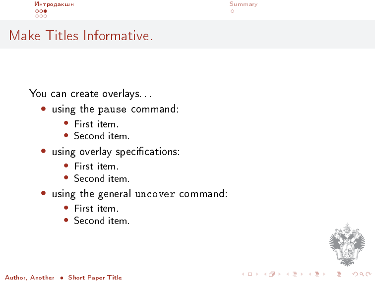
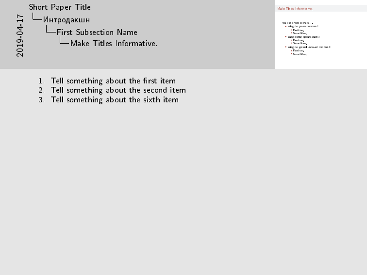

# PeterhofBeamer

Шаблон презентации Мат-Меха и не только. Используются цвета и логотип, вдохновленные одним местным вузом.
Логотип вуза взят на [сайте](http://spbu.ru).

## Сборка

Для использования eps лого собирайте следующим образом:

`latex beamer.tex; dvips beamer.dvi; ps2pdf beamer.ps`

При сборке с `pdflatex` будет использоваться png лого

## Скриншоты

