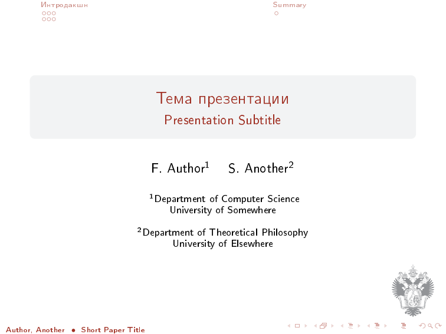

# PeterhofBeamer

Шаблон презентации Мат-Меха и не только. Используются цвета и логотип, вдохновленные одним местным вузом.
Логотип вуза взят на [сайте](http://spbu.ru).

Beamer template with a theme inspired by a certain university located in Peterhof, Russia. University logo is used from [here](http://spbu.ru)

## Сборка/Build

Для использования eps лого собирайте следующим образом (for eps logo build like this):

`latex beamer.tex; dvips beamer.dvi; ps2pdf beamer.ps`

При сборке с `pdflatex` будет использоваться png лого

If you build with `pdflatex` png logo will be used

## Скриншоты/Screenshots

### Титульный слайд/Title page

### Внутренний слайд/Page example

### Пример заметки/Notes example

